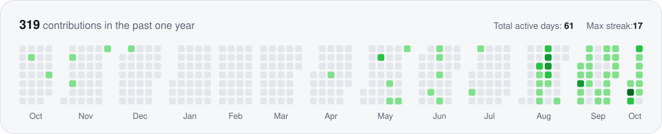

  <a href="https://owaisazmal.github.io/DevPortfolio/">
    <picture>
      <source media="(prefers-color-scheme: dark)" srcset="assets/header-dark.svg">
      
    </picture>
  </a>

  <a href="https://owaisazmal.github.io/DevPortfolio/"><b>Portfolio</b></a>
  &nbsp;&nbsp;·&nbsp;&nbsp;
  <a href="https://www.linkedin.com/in/owais-khan-266492222/"><b>LinkedIn</b></a>
  &nbsp;&nbsp;·&nbsp;&nbsp;
  <a href="https://stackoverflow.com/users/26470030/owais-khan"><b>Stack Overflow</b></a>
  &nbsp;&nbsp;·&nbsp;&nbsp;
  <a href="https://leetcode.com/u/owaisazmal/"><b>LeetCode</b></a>
  &nbsp;&nbsp;·&nbsp;&nbsp;
  <a href="mailto:owais.develops@gmail.com"><b>Email</b></a>

### About

I'm a mobile developer in Los Angeles. At [Hidonix](https://hidonix.com/en/ion-indoor-outdoor-navigation) I work on ION, an indoor and outdoor navigation platform. On my own time I design, build and ship apps for iPhone, iPad and Android. They are private by default, with no accounts, no ads and no tracking, and most of them are open source.

* **Open to contributions** on [OwlLuna](https://github.com/owaisazmal/OwlLuna)
* **Ask me about** Swift, SwiftUI, Kotlin, React Native, Firebase, Core Data and neural networks
* **Reach me at** owais.develops@gmail.com

### Now building

<table>
  <tr>
    <td width="50%" valign="top">
      <h3><a href="https://github.com/owaisazmal/OwlLuna">OwlLuna</a></h3>
      
<b>Handwritten notes for iPad</b>

      
A free, open source alternative to Notability and GoodNotes with no subscriptions, no ads and no tracking. Apple Pencil ink, PDF annotation, handwriting search, flashcards, and recordings that replay in step with your ink.

      
<code>Swift</code> <code>SwiftUI</code> <code>PencilKit</code> <code>Vision</code> <code>SwiftData</code>

    </td>
    <td width="50%" valign="top">
      <h3><a href="https://github.com/owaisazmal/Rin">Rin</a></h3>
      
<b>Monthly planning for iOS and Android</b>

      
A planner built around a radial habit tracker, with a year grid, deadlines and eight home screen widgets. Backups are optional and encrypted on the phone before they leave it. <a href="https://owaisazmal.github.io/Rin/">Visit the site</a>.

      
<code>React Native</code> <code>Expo</code> <code>TypeScript</code> <code>Swift</code> <code>Firebase</code>

    </td>
  </tr>
</table>
<table>
  <tr>
    <td width="50%" valign="top">
      <h3><a href="https://github.com/owaisazmal/PDF-Editor">Kitefold</a></h3>
      
<b>File converter for iOS and Android</b>

      
A free image and document converter that does all of its work on the device. HEIC to JPG, WebP, PDF in both directions, batch conversion, resize and compress. The Android release ships without the internet permission, so no file can leave the phone.

      
<code>React Native</code> <code>Expo</code> <code>TypeScript</code> <code>Swift</code> <code>Kotlin</code>

    </td>
    <td width="50%" valign="top">
      <h3><a href="https://github.com/owaisazmal/Notelore">Notelore</a></h3>
      
<b>Meeting recorder for iOS</b>

      
A calm recorder and notes companion. It records the room, transcribes on the device, and keeps every conversation as searchable minutes with key points, decisions and action items. Apple frameworks only, with zero third party dependencies.

      
<code>Swift</code> <code>SwiftUI</code> <code>SwiftData</code> <code>Speech</code> <code>Gemini</code>

    </td>
  </tr>
</table>

### Tech stack

  <b>Mobile</b> 
  
  
  
  
  

  <b>Web</b> 
  
  
  
  

  <b>Data and ML</b> 
  
  
  
  

  <b>Cloud and tools</b> 
  
  
  
  
  
  

### GitHub activity

  <picture>
    <source media="(prefers-color-scheme: dark)" srcset="assets/contributions-dark.svg">
    
  </picture>

  <picture>
    <source media="(prefers-color-scheme: dark)" srcset="https://streak-stats.demolab.com/?user=owaisazmal&hide_border=true&background=00000000&stroke=30363d&ring=5aa9ff&fire=f5b84a&currStreakNum=f3f4f6&sideNums=f3f4f6&currStreakLabel=5aa9ff&sideLabels=8b92a0&dates=8b92a0">
    
  </picture>
  <picture>
    <source media="(prefers-color-scheme: dark)" srcset="https://github-readme-stats.shion.dev/api/top-langs/?username=owaisazmal&layout=compact&langs_count=8&hide=makefile,cmake&hide_border=true&bg_color=00000000&title_color=f3f4f6&text_color=8b92a0">
    
  </picture>

### Get in touch

Have an app idea? Pitch it to me. If I like it, I will build it and publish it for free, with no paywall and no pro tier. Want to try what I'm building before everyone else? Join the beta. Both start on my [portfolio](https://owaisazmal.github.io/DevPortfolio/), or you can write to owais.develops@gmail.com.
